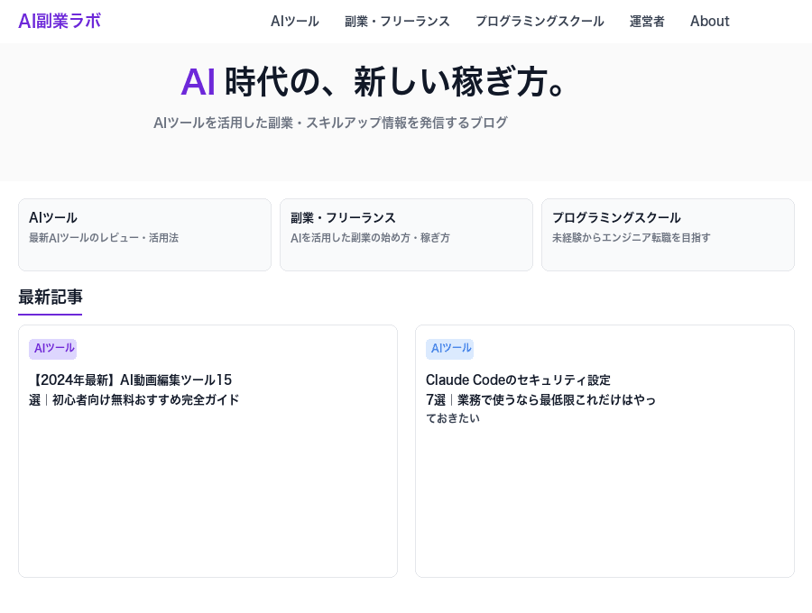

# vibecoding-ui-disambiguate

**Vibe Codingで「上の画像のところ」と言ったら、AIが実際のサイト画面で聞き返してくれるツール**



---

## これは何？

AIにWebサイトを作ってもらうとき、こんな指示をしていませんか？

- 「上の画像のところを変えて」
- 「右のボタンのやつ」
- 「ポップアップを出して」

用語がわからないと、AIが違う場所を修正してしまうことがあります。

このツールは、**曖昧な表現を入力すると候補用語を探し出し、実際のサイト画面に色枠で「ここですか？」と聞き返す**ためのスクリプトです。

---

## デモの流れ

```
ユーザー「上の画像のところ」
↓
候補を検索: ヒーローセクション / ヘッダー / ナビゲーションバー
↓
実際のサイト画面に色枠を表示
↓
「[A]ヒーローセクション [B]ヘッダー のどれですか？」
↓
ユーザーが選択 → 確定して実装へ
```

---

## 使い方

### 1. 候補を検索してオーバーレイJSを生成

```bash
node ui-disambiguate.mjs "上の画像のところ"
```

出力例：

```
📋 候補用語:
  [A] ヒーローセクション — ページ上部の全幅画像＋見出し＋CTAのエリア
  [B] ナビゲーションバー — サイト全体のリンクが並ぶナビゲーション
  [C] ヘッダー — ページ最上部のナビゲーションエリア

📌 【STEP 1】 preview_eval に貼るJS（オーバーレイ表示）:
...（JSコード）...
```

### 2. Claude Code の preview_eval に貼る

出力されたJSを `preview_eval` で実行すると、サイト画面に色枠が表示されます。

### 3. スクリーンショットを撮ってユーザーに確認

```
preview_screenshot → 「[A]・[B]・[C]のどれですか？」
```

### 4. 選んでもらったら確定して作業を続ける

---

## 対応している用語（14種類）

| 曖昧な表現 | 検出する用語 |
|---|---|
| 上の大きい画像 | ヒーローセクション |
| 上のバー、ナビ | ヘッダー / ナビゲーションバー |
| 一番下 | フッター |
| 切り替わる画像 | カルーセル / スライダー |
| 箱、タイル | カード |
| ポップアップ | モーダル |
| 横のやつ | サイドバー |
| 三本線 | ハンバーガーメニュー |
| パンくず | パンくずリスト |
| 大きいボタン | CTAボタン |
| 開閉するやつ | アコーディオン |
| 入力欄 | フォーム |
| かたまり | セクション |

---

## Claude Code への組み込み方

`CLAUDE.md` に以下を追記するだけです：

```markdown
## ビジュアルUI曖昧解消ワークフロー

ユーザーが曖昧な表現でUIの場所を指示したとき：
1. `node ui-disambiguate.mjs "ユーザーの発言"` を実行
2. 出力されたJSを preview_eval で実行
3. preview_screenshot でスクリーンショット撮影
4. 「[A]・[B]のどれですか？」と確認
5. 確定した用語で作業を続ける
```

---

## 関連リンク

- [Vibe Coding 用語集](https://vibecoding-glossary.pages.dev/) — 用語の詳細はこちら

---

MIT License
